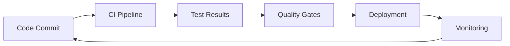

# CI/CD Explanation for Master Thesis

## Continuous Integration (CI)

### Definition
Continuous Integration is the practice of automatically building and testing code changes as soon as they are committed to version control. The primary goal is to detect integration errors early and improve code quality.

### CI Components in This Project

#### 1. Automated Testing Pipeline
```yaml
# Triggered on every push to main/develop branches or PR
on:
  push:
    branches: [ main, develop ]
  pull_request:
    branches: [ main, develop ]
```

**Testing Strategy:**
- **Unit Tests**: Test individual components in isolation
- **Integration Tests**: Test component interactions
- **Performance Tests**: Load testing with Locust
- **Security Tests**: Vulnerability scanning

#### 2. Code Quality Checks
```bash
# Linter checks ensure code consistency
flake8 app/ tests/ scripts/          # Python style guide compliance
pylint app/ tests/ scripts/          # Code quality analysis
black --check app/ tests/ scripts/    # Code formatting
isort --check-only app/ tests/ scripts/ # Import sorting
```

**Benefits:**
- Consistent code style across team
- Early detection of potential bugs
- Improved maintainability
- Reduced code review time

#### 3. Security Scanning
```bash
# Static Application Security Testing (SAST)
bandit -r app/                       # Python security issues

# Dependency vulnerability scanning
safety check                         # Package security issues

# Container security scanning
trivy image cicd-demo:latest         # Docker image vulnerabilities
```

**Security Layers:**
- **Code-level**: SAST scanning for security anti-patterns
- **Dependencies**: Known vulnerability database checks
- **Container**: Image layer vulnerability scanning

#### 4. Build Process
```dockerfile
# Multi-stage build for optimization
FROM python:3.11-slim as builder
# Build dependencies

FROM python:3.11-slim as runtime
# Runtime environment
```

**Build Optimization:**
- **Multi-stage builds**: Reduce final image size
- **Layer caching**: Faster rebuilds
- **Security scanning**: Built-in vulnerability detection

## Continuous Deployment (CD)

### Definition
Continuous Deployment is the practice of automatically deploying code changes to production environments after passing all quality gates. This enables rapid, reliable software delivery with minimal human intervention.

### CD Components in This Project

#### 1. Environment Strategy
```yaml
# Multi-environment deployment
staging:
  branch: develop
  auto-deploy: true
  
production:
  branch: main
  auto-deploy: false  # Manual approval required
```

**Environment Separation:**
- **Staging**: Integration testing environment
- **Production**: Live user-facing environment
- **Data Isolation**: Separate data per environment

#### 2. Deployment Pipeline
```yaml
# Automated deployment workflow
deploy-staging:
  runs-on: ubuntu-latest
  if: github.ref == 'refs/heads/develop'
  steps:
    - name: Deploy to staging
      run: curl ${{ secrets.RENDER_STAGING_DEPLOY_HOOK }}

deploy-production:
  runs-on: ubuntu-latest
  if: github.ref == 'refs/heads/main'
  environment: production
  steps:
    - name: Deploy to production
      run: curl ${{ secrets.RENDER_PROD_DEPLOY_HOOK }}
```

**Deployment Characteristics:**
- **Automated**: Zero-touch deployment
- **Rollback capability**: Quick recovery from failures
- **Health checks**: Post-deployment verification
- **Monitoring**: Real-time deployment tracking

#### 3. Quality Gates
```yaml
# Deployment only if all checks pass
jobs:
  deploy:
    needs: [test, security, performance]
    if: success()  # Only deploy if all previous jobs succeed
```

**Quality Gates Include:**
- All tests passing
- Security scan clean
- Performance benchmarks met
- Code coverage threshold
- Manual approval for production

## Integration Benefits

### 1. Feedback Loop Acceleration


**Time Reduction:**
- **Traditional**: Days/weeks for feedback
- **CI/CD**: Minutes for feedback
- **Deployment**: From weeks to hours

### 2. Risk Mitigation
```python
# Automated rollback on failure
def deploy_with_rollback():
    try:
        deploy_application()
        health_check()
    except DeploymentError:
        rollback_to_previous_version()
        alert_team()
```

**Risk Reduction:**
- **Small changes**: Reduced blast radius
- **Automated testing**: Early issue detection
- **Quick rollbacks**: Minimal downtime
- **Monitoring**: Real-time issue detection

### 3. Quality Improvement
```yaml
# Quality metrics collection
metrics:
  test_coverage: >80%
  security_issues: 0
  performance_baseline: <100ms
  deployment_success_rate: >95%
```

**Quality Metrics:**
- **Test Coverage**: Ensures code reliability
- **Security Score**: Maintains security posture
- **Performance**: Guarantees user experience
- **Success Rate**: Ensures deployment reliability

## Implementation Challenges

### 1. Cultural Transformation
**From:**
- Manual deployments
- Long release cycles
- Fear of breaking changes
- Siloed responsibilities

**To:**
- Automated deployments
- Continuous delivery
- Experimentation culture
- Shared ownership

### 2. Technical Complexity
**Challenges:**
- Database migrations
- Configuration management
- Environment parity
- Rollback strategies

**Solutions:**
- Blue-green deployments
- Feature flags
- Infrastructure as code
- Automated testing

### 3. Organizational Alignment
**Required Changes:**
- Cross-functional teams
- DevOps culture adoption
- Tool standardization
- Process reengineering

## Measurement and Metrics

### 1. Development Metrics
```yaml
key_metrics:
  lead_time: "Time from commit to deployment"
  deployment_frequency: "Deployments per week"
  change_failure_rate: "Failed deployments percentage"
  mean_time_to_recovery: "Time to restore service"
```

### 2. Quality Metrics
```yaml
quality_metrics:
  test_coverage: "Code coverage percentage"
  security_vulnerabilities: "Number of security issues"
  performance_regression: "Response time changes"
  defect_density: "Bugs per line of code"
```

### 3. Business Metrics
```yaml
business_metrics:
  feature_cycle_time: "Idea to production time"
  customer_satisfaction: "User feedback scores"
  system_availability: "Uptime percentage"
  cost_per_deployment: "Deployment cost analysis"
```

## Best Practices

### 1. Pipeline Design
- **Fast feedback**: Quick pipeline execution
- **Parallel execution**: Run tests concurrently
- **Fail fast**: Stop pipeline on first failure
- **Incremental builds**: Only test changed code

### 2. Testing Strategy
- **Test pyramid**: More unit tests, fewer E2E tests
- **Test automation**: Manual testing only for exploration
- **Test data management**: Consistent test environments
- **Performance testing**: Regular load testing

### 3. Security Integration
- **Shift-left security**: Security from development start
- **Automated scanning**: Continuous security checks
- **Vulnerability management**: Track and fix issues
- **Compliance reporting**: Automated audit trails

### 4. Monitoring and Observability
- **Comprehensive logging**: Structured, searchable logs
- **Metrics collection**: Performance and business metrics
- **Alerting**: Proactive issue detection
- **Dashboarding**: Real-time system visibility

## Conclusion

This CI/CD implementation demonstrates modern software delivery practices that:

1. **Accelerate delivery** from weeks to hours
2. **Improve quality** through automated testing
3. **Reduce risk** with small, frequent deployments
4. **Enhance security** with integrated scanning
5. **Enable innovation** through reliable automation

The project serves as a comprehensive example of how CI/CD principles can be applied in practice, providing valuable insights for organizations undergoing digital transformation and DevOps adoption.
